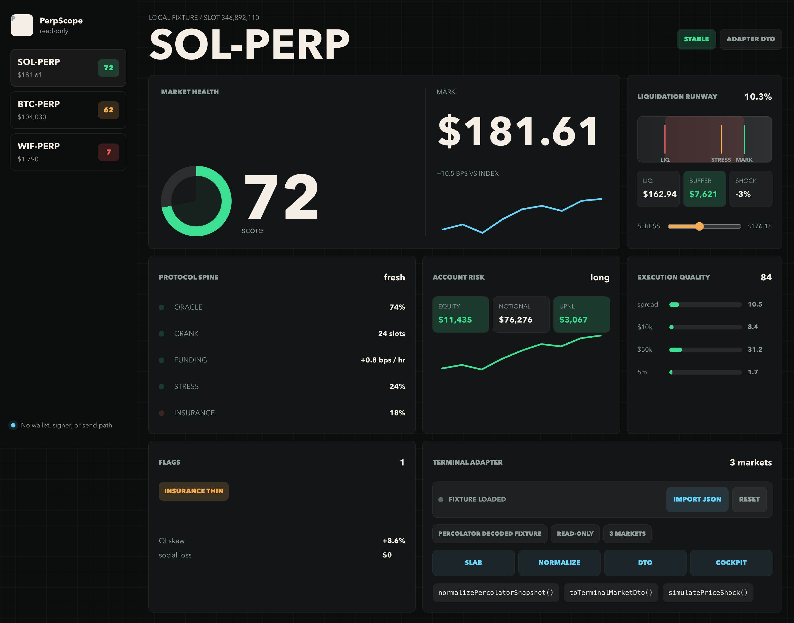
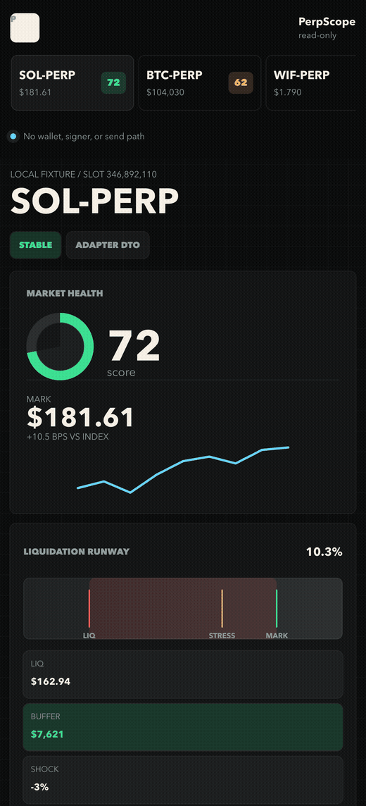
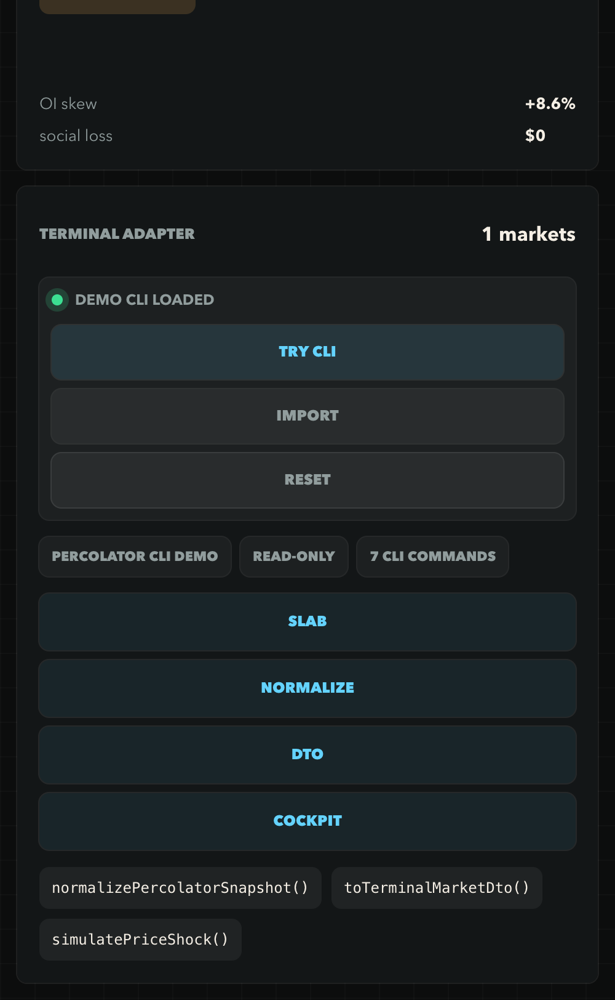
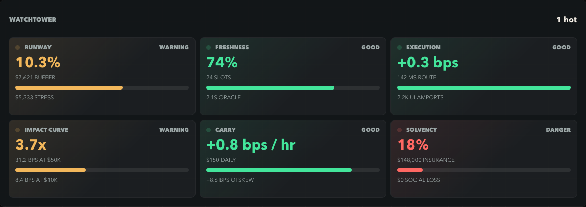
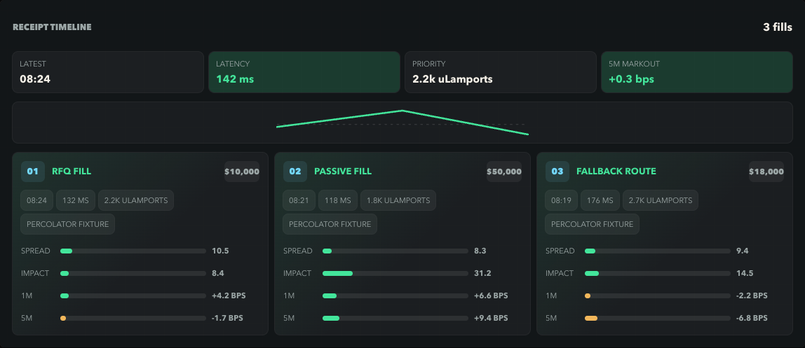
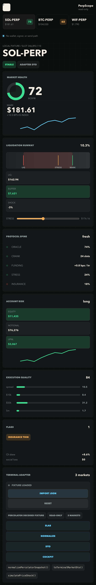

# PerpScope

PerpScope is a read-only Percolator risk cockpit plus an embeddable terminal adapter kit for Solana perps interfaces.

It is built around a simple idea: traders should understand market health, liquidation runway, oracle/crank freshness, funding/skew pressure, and execution quality without reading a wall of raw protocol output.

Live demo: [williamclay8.github.io/perpscope](https://williamclay8.github.io/perpscope/)



## 30-Second Value

For traders, PerpScope turns decoded perps state into scan-friendly risk: liquidation runway, oracle/crank freshness, funding and OI skew pressure, execution quality, impact, solvency, and receipt history.

For terminal builders, it provides a read-only adapter package that turns Percolator-like decoded output into a stable DTO you can render in your own frontend.

```js
import {
  buildPercolatorCompatibilityReport,
  buildWatchtowerSignals,
  normalizeFundingSkewHistory,
  normalizePercolatorSnapshot,
  simulatePriceShock
} from "@perpscope/percolator-adapter";

const snapshot = normalizePercolatorSnapshot(decodedPercolatorOutput);
const market = snapshot.markets[0];
const stress = simulatePriceShock(market, -5);

const compatibility = buildPercolatorCompatibilityReport(decodedPercolatorOutput, snapshot);
const signals = buildWatchtowerSignals(market, stress);
const carryHistory = normalizeFundingSkewHistory(market.history.fundingSkew, market);
```

No wallet adapter. No signing. No order entry. Just observability, simulation, and frontend-ready data.











## Why This Exists

Solana perps terminals are getting better, but terminal teams still have to decode protocol state, reconcile risk math, and present safety-critical data clearly. PerpScope is the neutral read-only layer:

- a cockpit traders can keep open while checking perps risk
- a fixture-first adapter package terminal builders can embed or test against
- a safety boundary that never connects wallets, signs, sends, routes, or recommends trades

## Why Star This

Star PerpScope if you are building a Solana perps terminal, risk dashboard, or agent-readable trading workflow and want:

- a clean DTO for decoded Percolator-like market, account, execution, and receipt data
- a compatibility report for pasted or dropped decoded captures before your terminal adapter is complete
- import fixtures for CLI logs, captured stdout, read-only RPC fixtures, carry history, and terminal adapter demos
- a visual reference for presenting risk without turning the screen into protocol JSON
- a read-only safety boundary you can copy into your own frontend
- a package-consumer example you can run before wiring a real terminal

## External Consumer Example

`examples/adapter-consumer/` is a tiny outside-terminal package that imports `@perpscope/percolator-adapter` by package name and prints the normalized fields a frontend would usually consume first.

For terminal projects outside this repo:

```bash
npm install @perpscope/percolator-adapter
```

For the local example:

```bash
cd examples/adapter-consumer
npm install
npm run demo
```

It is intentionally boring in the best way: load a read-only fixture, normalize it, compute Watchtower signals, return carry history and provenance.

## Watchtower

Watchtower is the trader-facing read-only signal layer inside PerpScope. It compresses normalized protocol data into six compact cards:

- runway: liquidation distance, margin buffer, and stress buffer
- freshness: oracle age and crank lag
- execution: receipt markout, latency, and priority fee pressure
- impact curve: $50k impact versus $10k impact
- carry: funding and OI-skew pressure
- solvency: insurance coverage and social-loss state

It is deliberately observational. It does not recommend a direction, place an order, connect a wallet, or submit a transaction.

## Carry History

The cockpit includes a compact funding/skew history panel for:

- funding bps/hour
- long/short OI skew
- stress usage
- oracle age
- source timestamp and slot provenance

The same parser accepts fixture arrays and captured terminal logs like `examples/funding-skew-history.stdout.json`.

## Capture Intake

PerpScope v0.4 adds a read-only capture intake panel and adapter helper for messy decoded protocol output. Paste, drop, or import JSON/stdout and PerpScope will:

- normalize the sections it understands
- score terminal compatibility
- show mapped sections, missing fields, ignored fields, source commands, slab, and program provenance
- reject secret-bearing or mutating fields before rendering

The public helper is `buildPercolatorCompatibilityReport(input, snapshot?)`, exported from `@perpscope/percolator-adapter`.

Terminal builders can use the field-level contract in `docs/field-compatibility-map.md` and the machine-readable `examples/field-compatibility-map.json` to see accepted aliases, required fields, Watchtower dependencies, carry-history inputs, ignored fields, and rejected wallet/signer/transaction/order payloads.

Real decoded shapes can be submitted through `docs/feedback-loop.md` or the GitHub issue form at `.github/ISSUE_TEMPLATE/decoded-percolator-shape.yml`.

Start with `docs/terminal-builder-quickstart.md` if you are wiring the npm adapter into a terminal.

## Live Read-Only Deployment Examples

PerpScope v0.2 adds deployment-style read fixtures that mirror how a terminal can validate a selected Percolator slab through an injected RPC client:

| fixture | cluster | read | owner | data length | magic | oracle |
| --- | --- | --- | --- | --- | --- | --- |
| `examples/percolator-mainnet-sol.readonly-rpc.json` | `mainnet-beta` | `getAccountInfo` | `Perco1ator...111111` | `524800` | `50455243` | `2.0s / 8s` |
| `examples/percolator-devnet-wif.readonly-rpc.json` | `devnet` | `getAccountInfo` | `Perco1ator...111111` | `262400` | `50455243` | `7.2s / 8s` |

Each fixture carries `expectations` for owner, account data length, slab magic/discriminator, required decoded sections, and maximum oracle age. `summarizeReadOnlyRpcDeployment()` fails closed if those expectations drift.

## Run

```bash
npm start
```

Then open the printed local URL.

## Check

```bash
npm run check
```

## Try Imports

Open the cockpit and use `Try CLI` for the bundled Percolator command demo. You can also use `Paste`, `Import`, or drag JSON/captured stdout into the capture intake:

```text
examples/decoded-slab.snapshot.json
examples/execution-receipts.stdout.json
examples/percolator-cli.bundle.json
examples/percolator-list-markets.stdout.json
examples/read-only-rpc.fetch.json
examples/percolator-mainnet-sol.readonly-rpc.json
examples/percolator-devnet-wif.readonly-rpc.json
examples/funding-skew-history.stdout.json
examples/adapter-consumer/
examples/terminal-recipes.json
examples/terminal-dto-export.json
```

The import path accepts full PerpScope snapshots shaped as:

```js
{
  source: { label, mode, generatedAt },
  cluster,
  currentSlot,
  markets: [
    {
      id, name, base, quote, slab, program,
      header,
      config,
      oracle,
      engine,
      account,
      execution
    }
  ]
}
```

Snapshots containing wallet, keypair, seed, mnemonic, private, or secret-looking fields are rejected before rendering.

It also accepts Percolator CLI command bundles and captured stdout shaped as:

```js
{
  label: "Percolator CLI demo",
  cluster: "mainnet-beta",
  market: { symbol, base, quote, slab, program },
  commands: [
    { command: "list-markets", output },
    { command: "slab:get", output },
    { command: "slab:params", output },
    { command: "slab:engine", output },
    { command: "best-price", output },
    { command: "execution:receipts", output },
    { command: "slab:account", output },
    { command: "slab:accounts", output },
    { command: "slab:bitmap", output }
  ]
}
```

Captured `stdout`, `stdoutText`, `output`, `data`, and `result` fields are parsed through the same read-only path. Receipt arrays can be imported as `receipts`, `executionReceipts`, `receiptTimeline`, or an `execution:receipts` command output. Raw protocol integer fields such as `capital`, `pnl`, `positionBasisQ`, `vault`, or unscaled `price` are not displayed as USD unless the input uses explicit USD fields like `collateralUsd`, `unrealizedPnlUsd`, `vaultUsd`, `priceUsd`, or includes price decimals.

## Schemas

Published JSON schema contracts live in:

```text
schemas/perpscope-snapshot.schema.json
schemas/percolator-cli-bundle.schema.json
schemas/read-only-rpc-fetch.schema.json
schemas/funding-skew-history.schema.json
```

The source-backed adapter field map lives in `docs/field-compatibility-map.md`, with a JSON manifest at `examples/field-compatibility-map.json`.

The terminal-builder quickstart lives in `docs/terminal-builder-quickstart.md`.

## Embeddable Adapter Package

The adapter boundary lives in `packages/percolator-adapter` and re-exports the pure read-only helpers used by the cockpit:

```js
import {
  buildPercolatorCompatibilityReport,
  buildWatchtowerSignals,
  normalizeFundingSkewHistory,
  normalizePercolatorSnapshot,
  simulatePriceShock
} from "./packages/percolator-adapter/index.js";

const snapshot = normalizePercolatorSnapshot(decodedJson);
const market = snapshot.markets[0];
const stress = simulatePriceShock(market, -5);
const compatibility = buildPercolatorCompatibilityReport(decodedJson, snapshot);
const watchtower = buildWatchtowerSignals(market, stress);
const carryHistory = normalizeFundingSkewHistory(market.history.fundingSkew, market);
```

The package is intentionally side-effect free. It does not create wallets, sign, send, route, or submit transactions.

## Terminal Builder Quickstart

```js
import {
  buildPercolatorCompatibilityReport,
  detectPercolatorInputShape,
  normalizeFundingSkewHistory,
  normalizePercolatorSnapshot,
  simulatePriceShock
} from "./packages/percolator-adapter/index.js";

const inputShape = detectPercolatorInputShape(decodedJson);
const snapshot = normalizePercolatorSnapshot(decodedJson);
const market = snapshot.markets[0];
const stress = simulatePriceShock(market, -5);
const compatibility = buildPercolatorCompatibilityReport(decodedJson, snapshot);
const carryHistory = normalizeFundingSkewHistory(market.history.fundingSkew, market);
```

Use the normalized DTO to render your own terminal modules without coupling the terminal UI to raw Percolator CLI output. Today the adapter understands PerpScope snapshots plus captured stdout and read-only bundles from `list-markets`, `slab:get`, `slab:params`, `slab:engine`, `best-price`, `execution:receipts`, `slab:account`, `slab:accounts`, and `slab:bitmap`.

## Terminal Import/Export Recipes

`examples/terminal-recipes.json` documents eight paths:

- file import from `examples/decoded-slab.snapshot.json`
- drag/drop captured stdout from `examples/execution-receipts.stdout.json`
- command-bundle import from `examples/percolator-cli.bundle.json`
- market directory import from `examples/percolator-list-markets.stdout.json`
- injected read-only RPC from `examples/percolator-mainnet-sol.readonly-rpc.json`
- carry-history stdout from `examples/funding-skew-history.stdout.json`
- external package consumer from `examples/adapter-consumer/`
- DTO export using `examples/terminal-dto-export.json`
- capture intake compatibility report from pasted or dropped decoded JSON/stdout

The export shape keeps source provenance with `source.label`, `source.mode`, `source.commandSet`, `cluster`, `currentSlot`, `market.slab`, and `market.program` so a terminal can show where the risk state came from.

## Read-Only RPC Fetcher

The RPC helper is intentionally injectable and read-only. It validates owner, data length, magic bytes, and mutating field names, then converts decoded account data through the same adapter:

```js
import {
  buildReadOnlyRpcSnapshot,
  summarizeReadOnlyRpcDeployment
} from "./packages/percolator-adapter/index.js";

const snapshot = buildReadOnlyRpcSnapshot(decodedFixture);
const summary = summarizeReadOnlyRpcDeployment(decodedFixture);
```

`fetchReadOnlyRpcSnapshot(request, client)` accepts a client with `getAccountInfo()`. It does not create wallets, sign, send, route, or place orders.

## Adapter API

```js
import {
  buildPercolatorCompatibilityReport,
  detectPercolatorInputShape,
  normalizePercolatorSnapshot,
  simulatePriceShock
} from "./packages/percolator-adapter/index.js";

const shape = detectPercolatorInputShape(decodedPercolatorState);
const snapshot = normalizePercolatorSnapshot(decodedPercolatorState);
const compatibility = buildPercolatorCompatibilityReport(decodedPercolatorState, snapshot);
const market = snapshot.markets[0];
const stress = simulatePriceShock(market, -5);
```

The normalized market DTO includes:

- `healthScore` and `status`
- `price`, `crank`, `funding`, `marketStructure`, and `solvency`
- `account` liquidation distance, margin buffer, equity, PnL, and funding PnL
- `execution` spread, impact, markout, latency, and fill-quality score
- `execution.receipts` with spread, impact, 1m/5m markout, route latency, priority fee, source timestamp, and source label
- `buildPercolatorCompatibilityReport()` with `status`, `score`, `recognizedSections`, `missingFields`, and `ignoredFields`
- `Watchtower` signals for runway, freshness, execution, impact curve, carry, and solvency
- `history.fundingSkew` rows for funding, OI skew, stress usage, oracle age, source timestamp, and slot
- `flags` for stale oracle, crank lag, thin insurance, stress caps, and liquidation tightness

## Product Surface

- `src/lib/percolator-adapter.js` normalizes Percolator-like slab, oracle, crank, funding, insurance, account, and execution data into terminal-ready DTOs.
- `buildPercolatorCompatibilityReport()` maps partial decoded captures into visible terminal-readiness warnings.
- `src/lib/read-only-rpc-fetcher.js` validates read-only RPC slab fixtures and injected account fetches.
- `src/lib/watchtower-signals.js` and `src/lib/funding-history.js` power the embeddable package and cockpit panels.
- `packages/percolator-adapter/` is the package boundary for terminal builders.
- `examples/adapter-consumer/` shows the package from an outside-terminal point of view.
- `docs/field-compatibility-map.md` documents accepted aliases, required fields, Watchtower dependencies, and read-only rejection rules.
- `docs/feedback-loop.md` is the public intake loop for decoded Percolator shapes and missing terminal fields.
- `docs/terminal-builder-quickstart.md` shows the npm install path and the first DTO/signals to render.
- `docs/launch-post.md` and `docs/outreach-loop.md` contain launch copy and the first builder outreach loop.
- `docs/release-v0.4.0.md` mirrors the public release notes for the npm-live v0.4 release.
- `docs/v0.5-plan.md` scopes compatibility report export.
- `.github/ISSUE_TEMPLATE/decoded-percolator-shape.yml` is the structured intake form for sanitized builder samples.
- `src/fixtures/percolator-market.js` contains sample decoded market/account state plus execution receipt history.
- `src/app.js` renders the read-only cockpit.
- `schemas/` contains the public input contracts.
- `test/percolator-adapter.test.js` covers adapter safety and risk math.

## Design Principles

- Cockpit first, landing page second.
- Gauges, chips, bands, and sparklines before prose.
- Read-only status visible without scrolling.
- No `Connect`, `Trade`, `Long`, `Short`, `Sign`, or wallet-adjacent affordances.
- Risk state is semantic color plus label, never color alone.
- Mobile keeps the market switcher and risk summary reachable before secondary panels.

## Safety Boundary

PerpScope does not connect wallets, read keypair files, sign transactions, submit transactions, route orders, or give trade recommendations. It is an observability and simulation surface.

Production adapters should validate account owner, data length, discriminators/magic bytes, market config, oracle freshness, and source terms before displaying live data.

## Deployment

This is a static app. Any static host can serve the repo root after checks pass.

```bash
npm run check
npm start
```

Current public site: [williamclay8.github.io/perpscope](https://williamclay8.github.io/perpscope/).

## Roadmap

- v0.4 shipped: capture intake for pasted/dropped decoded outputs, compatibility scoring, missing-field warnings, and ignored-field mapping.
- v0.4 follow-up: field-level compatibility map for terminal import/export adapters.
- npm package shipped: `@perpscope/percolator-adapter@0.4.0`.
- v0.5 planned: downloadable compatibility report export for terminal builders.
- More deployment fixtures as Percolator terminal teams share read-only shapes.
